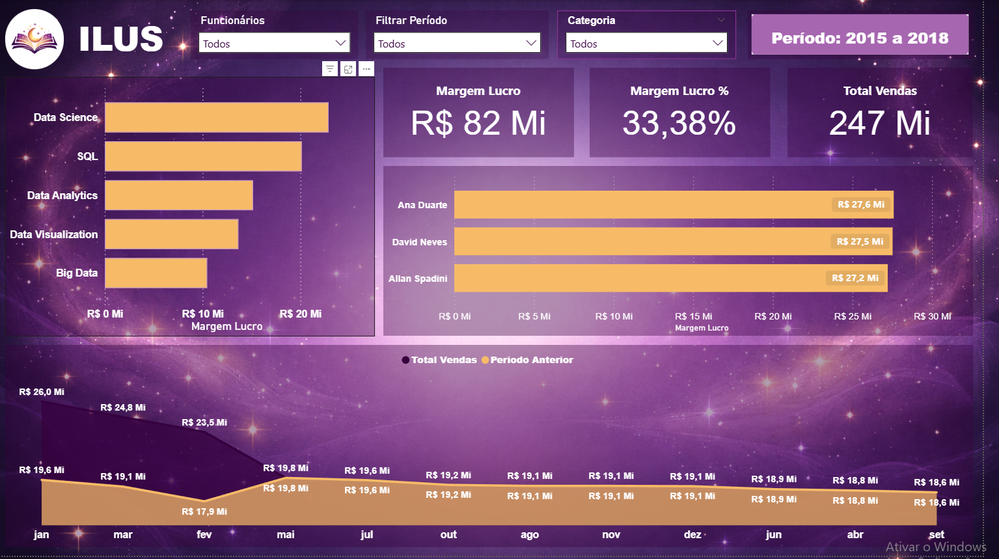

# 📚 Projeto de BI – Análise de Vendas de Livraria (DAX)

## 📌 Visão Geral

Este projeto tem como objetivo realizar uma **análise de dados de vendas de uma livraria**, utilizando **Power BI** com foco na criação de **medidas em DAX**, modelagem de dados e desenvolvimento de **dashboards interativos**.

O projeto explora métricas relacionadas a **vendas, faturamento, produtos e categorias de livros**, permitindo identificar padrões de consumo e gerar **insights estratégicos para o negócio**.

A estrutura do projeto foi organizada seguindo **boas práticas de Business Intelligence**, utilizando o formato **PBIP (Power BI Project)** para facilitar o versionamento no **GitHub**.

---

## 🎯 Objetivos do Projeto

- Analisar o desempenho de vendas da livraria
- Criar métricas e indicadores utilizando **DAX**
- Identificar categorias de livros mais vendidas
- Avaliar faturamento total e quantidade de vendas
- Desenvolver um **dashboard interativo**
- Aplicar boas práticas de modelagem de dados em BI

---

## 🗂️ Estrutura do Repositório

```text
📁 projeto-dax-livraria
 ├── 📁 data
 │    ├── livros.csv
 │    ├── vendas.csv
 │    ├── clientes.csv
 │    └── categorias.csv
 │
 ├── 📁 projeto-dax-livraria-inicial.Report
 ├── 📁 projeto-dax-livraria-inicial.SemanticModel
 ├── projeto-dax-livraria-inicial.pbip
 │
 └── README.md
```

---

## 🧠 Modelagem de Dados

O modelo de dados foi estruturado seguindo o conceito de **Modelo Estrela (Star Schema)**, muito utilizado em projetos de **Business Intelligence**, pois facilita a análise e melhora a performance das consultas.

### 🔹 Estrutura da Modelagem

**Tabela Fato**

- `vendas` → contém os registros de vendas realizadas pela livraria

**Tabelas Dimensão**

- `livros` → informações sobre os livros vendidos
- `categorias` → classificação dos livros
- `clientes` → dados dos clientes

Essa estrutura permite análises como:

- Faturamento por categoria
- Quantidade de livros vendidos
- Produtos mais vendidos
- Análise de vendas ao longo do tempo

---

## 📐 Métricas Criadas com DAX

Durante o desenvolvimento do projeto foram criadas **medidas utilizando DAX (Data Analysis Expressions)** para calcular indicadores importantes para análise do negócio.

Exemplos de métricas utilizadas:

- **Faturamento Total**
- **Quantidade Total de Vendas**
- **Total de Livros Vendidos**
- **Ticket Médio**
- **Vendas por Categoria**

Essas medidas permitem análises mais dinâmicas dentro do dashboard.

Exemplo de medida em **DAX**:

```DAX
Faturamento Total = SUM(vendas[valor_venda])
```

---

## ⚙️ Tratamento dos Dados (ETL)

O processo de **ETL (Extração, Transformação e Carga)** foi realizado utilizando **Power Query**, incluindo etapas como:

- Limpeza de dados
- Padronização de colunas
- Ajuste de tipos de dados
- Remoção de valores inconsistentes
- Preparação das tabelas para modelagem

Essas etapas garantem **maior qualidade e confiabilidade nas análises realizadas no Power BI**.

---

## 📊 Dashboard

O dashboard foi desenvolvido no **Power BI Desktop**, contendo visualizações que facilitam a análise de desempenho da livraria.

### Principais análises disponíveis

- Faturamento total da livraria
- Quantidade de livros vendidos
- Vendas por categoria
- Evolução das vendas ao longo do tempo
- Identificação dos livros mais vendidos

📷 **Preview do Dashboard**



---

## 🧩 Tecnologias Utilizadas

- **Power BI Desktop**
- **DAX (Data Analysis Expressions)**
- **Power Query**
- **Power BI Project (.pbip)**
- **Git**
- **GitHub**

---

## 🚀 Como Executar o Projeto

1️⃣ Clone este repositório:

```bash
git clone https://github.com/seu-usuario/projeto-dax-livraria.git
```

2️⃣ Abra o arquivo do projeto no **Power BI Desktop**:

```
projeto-dax-livraria-inicial.pbip
```

3️⃣ Certifique-se de que os arquivos de dados estejam na pasta correta.

4️⃣ Atualize os dados no Power BI para carregar as informações.

---

## 🔒 Observações Importantes

- Os dados utilizados são **educacionais**
- Este projeto foi desenvolvido para **aprendizado e prática de análise de dados**
- Não contém informações sensíveis

---

## 👨‍💻 Autor

Projeto desenvolvido por **Davi Estevam Silva**

🎯 Interesse nas áreas de:

- Business Intelligence
- Análise de Dados
- Power BI
- Data Analytics

📎 Este projeto faz parte do meu **portfólio profissional no GitHub**.

---

## ⭐ Contribuições

Sugestões e melhorias são bem-vindas!

Sinta-se à vontade para abrir uma **issue** ou enviar um **pull request**.

---

⭐ **Se este projeto foi útil para você, considere deixar uma estrela no repositório!**
